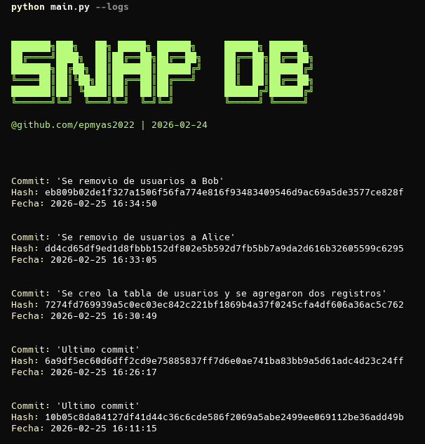

# SnapDB

Proyecto de control de versiones para bases de datos PostgreSQL. Permite realizar backups incrementales y gestionar el historial de cambios en la base de datos.

## Instalación

1. Clona el repositorio:

   ```bash
   git clone 
    ```

2. Navega al directorio del proyecto:

   ```bash
   cd SnapDB
   ```

3. Instala las dependencias:

   ```bash
   pip install -r requirements.txt
   ```

Instalación en modo editable:

```bash
pip install -e .
```

## Screenshot


